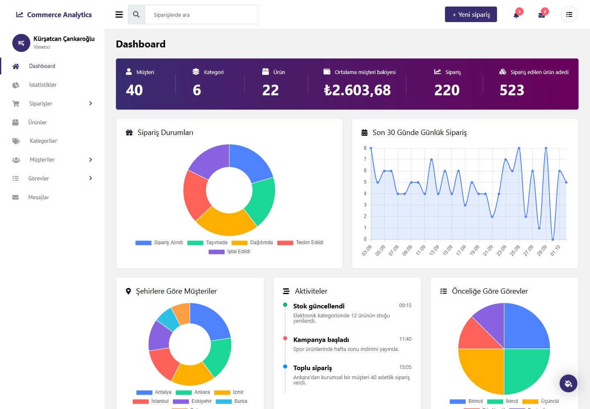
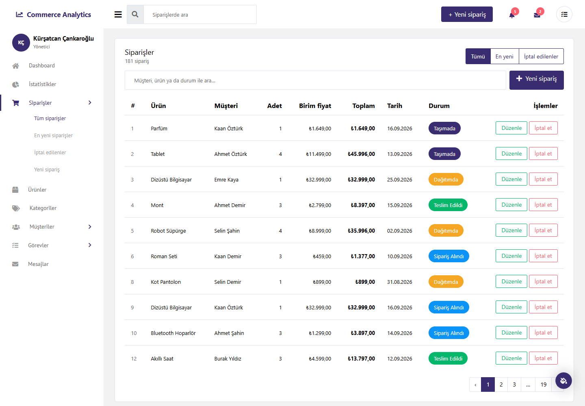

# EF Core Commerce Analytics

ASP.NET Core MVC ve Entity Framework Core ile yazılmış bir e-ticaret yönetim ve analiz paneli. Sipariş, ürün, kategori ve müşteri yönetiminin yanında; sipariş durumlarını, günlük sipariş trendini, şehirlere göre müşteri dağılımını ve mağaza istatistiklerini gösteren bir dashboard içerir. Görev sayfaları LINQ operatörlerini (Aggregate, Chunk, Concat, Union) gerçek veri üzerinde gösterir.



## Özellikler

- **Dashboard:** sayaçlar, sipariş durumu ve son 30 günün günlük sipariş grafikleri, şehirlere göre müşteriler, son siparişler, mesajlar ve görevler.
- **İstatistikler:** en popüler ürün, en çok ciro yapan kategori, en yüksek ve en düşük stok, fiyat dağılımı. Ciro ve popülerlik hesaplarında iptal edilen siparişler sayılmaz.
- **Siparişler:** arama ve sayfalama, aktif / en yeni / iptal edilen listeleri, sipariş oluşturma ve düzenleme. Fiyat ve toplam her zaman sunucuda, ürünün fiyatından hesaplanır.
- **Ürün, kategori, müşteri yönetimi:** doğrulamalı formlar. Siparişi olan bir müşteri, ürünü olan bir kategori silinmek istenirse silinmez, nedeni gösterilir.
- **Raporlar:** yüksek bakiyeli müşteriler, şehirlere göre müşteri sayısı, en çok sipariş alan şehirler ve o şehirlerin en iyi müşterileri.
- **Bildirimler:** yeni siparişler üst menüde bildirim olarak görünür; okunmamış mesajlar sayılır.



## Çalıştırma

Gerekenler: .NET 9 SDK ve SQL Server (Visual Studio ile gelen LocalDB yeterli).

```bash
git clone https://github.com/kursatcnk/EFCoreCommerceAnalytics.git
cd EFCoreCommerceAnalytics
dotnet run --project EFCoreCommerceAnalytics
```

Development ortamında uygulama açılırken bekleyen migration'ları uygular ve veritabanı boşsa örnek veri ekler (40 müşteri, 22 ürün, 220 sipariş...). Var olan veriye dokunmaz.

Varsayılan bağlantı `appsettings.json` içinde LocalDB'yi gösterir. Başka bir sunucu kullanmak için bağlantı dizesini dosyaya yazmak yerine user-secrets ile verin:

```bash
dotnet user-secrets set "ConnectionStrings:DefaultConnection" "Server=.;Database=ECommerceAnalyticsDB;Trusted_Connection=True;TrustServerCertificate=True" --project EFCoreCommerceAnalytics
```

Migration komutları için `dotnet-ef` depoya sabitlenmiştir:

```bash
dotnet tool restore
dotnet ef migrations add YeniMigration --project EFCoreCommerceAnalytics
```

## Testler

```bash
dotnet test
```

Testler EF Core InMemory kullanır, SQL Server gerektirmez. Servislerin iş kurallarını, raporların boş veritabanında çökmediğini, sayfaların açıldığını, CSRF ve XSS korumalarını kontrol eder. GitHub Actions her push'ta testleri çalıştırır.

## Proje yapısı

```
EFCoreCommerceAnalytics/
  Context/         AppDbContext ve model ayarları (hassasiyet, ilişkiler, indeksler)
  Entities/        Veritabanı tabloları; OrderStatuses ve ToDoPriorities sabitleri
  Services/        Bütün sorgular: kategori, ürün, müşteri, sipariş, görev, gelen kutusu, raporlar
  Controllers/     İnce controller'lar; servis çağırıp view seçer
  Models/          Form modelleri (doğrulama), sayfalama, rapor ve view modelleri
  ViewComponents/  Dashboard parçaları ve üst menü
  Infrastructure/  "1899.50" ve "1.899,50" yazımlarını kabul eden decimal bağlayıcı
  Data/            Development örnek verisi
  Views/           Razor view'ları; tablo satırları AJAX araması için partial
  wwwroot/         theme/ (admin teması), css/app.css, js/ (grafikler, arama, sipariş formu)
EFCoreCommerceAnalytics.Tests/   xUnit testleri
```

## Teknik notlar

- Silme ve iptal işlemleri POST'tur; bütün POST istekleri anti-forgery token ister.
- Formlar entity'lere değil input modellerine bağlanır; formda olmayan alanlar dışarıdan değiştirilemez.
- Para ve tarih biçimleri tr-TR'dir (₺1.234,50). Number input'lardan gelen noktalı değerler de doğru okunur.
- Kategori, ürün ya da müşteri silinince siparişler kaskad silinmez (`DeleteBehavior.Restrict`).
- Arayüz BootstrapDash'in ücretsiz Melody Admin temasını (Bootstrap 4) kullanır; `wwwroot/theme` altında yalnızca kullanılan dosyalar bulunur.

## Lisans

Bu depodaki kendi yazdığım kod (C#, Razor view'ları, `wwwroot/css/app.css`, `wwwroot/js`, testler) [MIT](LICENSE) lisanslıdır.

`EFCoreCommerceAnalytics/wwwroot/theme` klasörü bu kapsamın dışındadır. İçindeki dosyalar üçüncü taraflara ait ve kendi lisanslarına tabidir; ayrıntılar [THIRD-PARTY-NOTICES.md](THIRD-PARTY-NOTICES.md) dosyasında.
